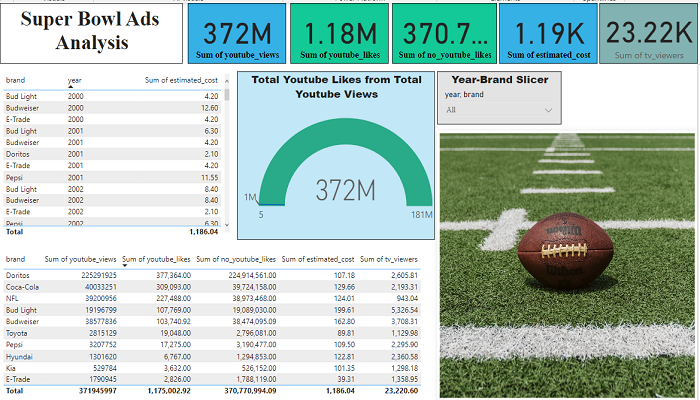
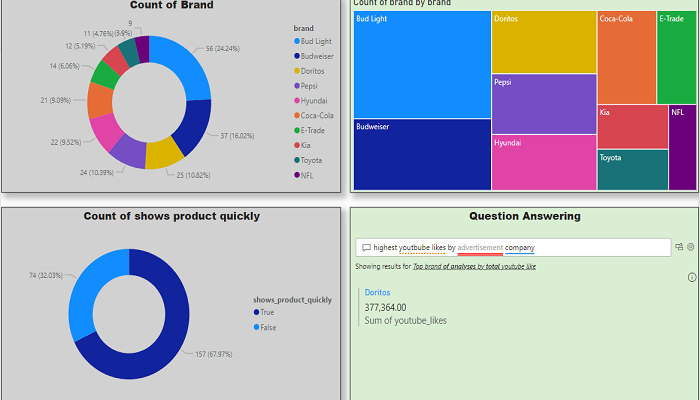

"Originally developed in Jan 2023, pushed to GitHub in April 2025."
# The Economics of Super Bowl Advertising

This project leverages **Python** and **Microsoft PowerBI** to analyze the economic dynamics of Super Bowl advertising. The original dataset is stored in the **original_data** folder.

**Python** was primarily employed to:
- **Load and structure the data** for analysis.
- **Explore and understand the data**, which included:
  - **Renaming columns** for clarity and consistency.
  - **Performing data cleaning** to ensure accuracy.
- Efficiently managing memory usage.
- Conducting **feature engineering** to enhance the dataset.
- Undertaking **exploratory data analysis** (EDA) to uncover trends and patterns.
- Drawing insights and conclusions based on various **visualizations**, including plots and tables.

For a detailed exploration of the Python-based analysis, refer to the **superbowl_ads.ipynb** notebook.

Following the data preparation and analysis in **Python**, **Microsoft PowerBI** was used to generate interactive visualizations. These can be found in the **powerbi_analysis** folder and are based on the **analysis.csv** file, which was derived from the **Python** analysis in the **my_data** folder.

## Visualizations from PowerBI

  

## Conclusion

- Upon analyzing the data and considering metrics such as YouTube views and likes, **Doritos** emerges as the most successful brand in terms of return on investment. Despite its relatively low ad spend, it outperforms larger advertisers like **Budweiser**, **Bud Light**, and **Coca-Cola**.
- Investors aiming to maximize profitability with minimal costs should consider **Doritos** as a prime candidate for high returns on advertising investments.
